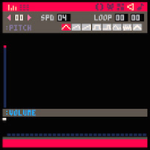

# Step 4: Stay In Screen



```lua

--paddle
padx = 52
pady = 122
padw = 24
padh = 4

--ball
ballx = 64
bally = 64
ballsize = 3
ballxdir = 5
ballydir = -3

function movepaddle()
	if btn(0) then
		padx -= 3
	elseif btn(1) then
		padx += 3
	end
end

function moveball()
	ballx += ballxdir
	bally += ballydir
end

function bounceball()
	--left
	if ballx < ballsize then
		ballxdir =- ballxdir
		sfx(0)
	end
	
	--right
	if ballx > 128 - ballsize then
		ballxdir =- ballxdir
		sfx(0)
	end
	
	--top
	if bally < ballsize then
		ballydir =- ballydir
		sfx(0)
	end
end

function _update()
	movepaddle()
	bounceball()
	moveball()
end

function _draw()
	--clear the screen
	rectfill(0, 0, 128, 128, 3)
	
	--draw the paddle
	rectfill(padx, pady, padx + padw, pady + padh, 15)
	
	--draw the ball
	circfill(ballx, bally, ballsize, 15)
end	

```

[Step 5: Ball Hits Paddle](step_5.md)
